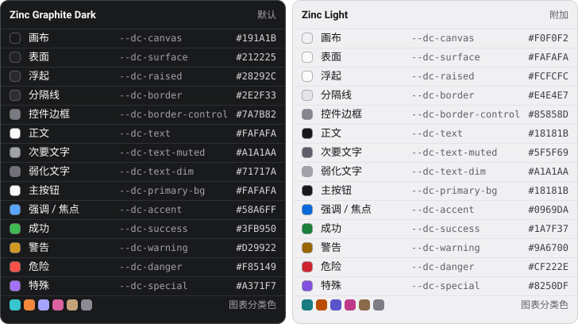

# dense-compact-ui

给 Claude Code、Codex 等编程 Agent 用的技能，指导它们设计、实现和评审紧凑、高信息密度的界面，适合工作台、管理后台、数据表格、编辑器这类信息密集的产品界面。

内容包括密度档位与行模型、1px 分隔线分区、圆角分层、数字与字阶、强调色配额、窄屏重组，以及表格、表单、实时数据、图表、AI 对话、编辑器、树形导航、设置页、登录等专题规则；附 Zinc 深色默认主题、可切换的浅色版和 CSS token（[`assets/tokens.css`](assets/tokens.css)）。

Agent 加载技能后会先问你是否采用这种风格；你已经明确要求紧凑或高密度时直接使用。海报、营销落地页这类追求视觉张扬的页面不适用。

## 色板

新建项目默认 Zinc Graphite Dark；Zinc Light 是可切换的浅色附加版。彩色只表达语义，强调色总面积不超过 10%，图表分类色只用于图表。完整变量与对比度说明见 [`assets/tokens.css`](assets/tokens.css) 和 [配色规则](references/color.md)。

## 安装

把本仓库作为一个技能目录放进 Claude Code / Codex 的 skills 目录（仓库根即技能根，入口为 `SKILL.md`），或在 [cc-switch](https://github.com/farion1231/cc-switch) 中以 `qyh9527/dense-compact-ui` 添加。

## 审计与改进

可以直接说「只评审这个工作台」「打磨筛选栏」「精简重复包装，但保留比较列」或「补齐失败恢复」。Agent 会按任务选择检查路径，给出带位置、证据、影响和复验方法的问题；仅评审时不改文件，明确要求修复时继续实施；结束前会把前后截图并排做一次观感检查。详见 [审计与定向改进](references/quality-workflow.md)。

验收分三档。改一个按钮的圆角、一处间距这类局部小改走**轻度**：只查改动处和一两个视口，结论最多写「轻度检查范围内未发现」。改一个功能、一个共享组件，或新增展开、报错、空列表、加载中这类状态走**中度**：先写一行范围（页面、视口、状态），用步骤文件把页面操作到各个状态再量，修完按同样条件复查，结论只对写下的范围成立。新页面、改版、改全局 token 或全局样式、交付前验收走**全套**：先写验收契约（目标、状态、视口、预算、授权），按风险取样检查，每条结论标明证据等级，最后给出 verified / partial / blocked。可以直接说「快速检查一下工具栏」「验一下筛选功能」或「对这个页面做全套验收」；不指定时 Agent 按改动的影响范围自己选，并说明理由。

核心工作流适用于 Web、桌面、原生与跨平台前端，按页面任务选择空间体系，分开维护产品事实与视觉约定。验证工具和测量单位按平台选择，浏览器不是前提。

Web 页面可以用随技能附带的 [`scripts/dense-audit.js`](scripts/dense-audit.js) 在浏览器里量取：重复对象视图的行高与一屏可见项数、强调色面积、字号与圆角是否偏离 token 刻度，以及过小字号、卡片嵌套、数字未等宽、触屏热区不足、关键数字被截断、多个主按钮；还会检查整页意外横向滚动、焦点环被容器裁掉、按钮被透明层盖住、网络字体或图标字体加载失败后悄悄回退、破图，以及写了 `gap` 等布局属性却因为 `display` 不对而没生效；跟随系统深浅色的页面还能两种配色各跑一次，找出颜色写死、切换后看不清或成了孤岛的地方；加 `--scroll` 时还会滚到顶和底，检查第一项、最后一项是不是被固定栏永远挡住；还可以写一份步骤文件，让它先点击、输入、选择到目标状态再量取，某一步没达到预期会直接报出来；每个视口、配色和状态还能各存一张截图，给 Agent 做观感检查。命令行可以一次跑多个视口。它零依赖、不要求给项目加标注，结果是需要复核的线索，不是验收结论。用法见 [浏览器内量取脚本](references/audit-script.md)。

设计依据与取舍记录在 [docs/design-rationale.md](https://github.com/qyh9527/dense-compact-ui/blob/main/docs/design-rationale.md)，供维护者修改主题、密度或动效前查看，不进入发布包。

## 版本

技能文件推到 `main` 后由 GitHub Actions 自动发 release，附打包好的技能 zip。默认升 patch 版本；提交标题里写 `[minor]` 或 `[major]` 升对应级别，写 `[skip release]` 则这次不发。

## 许可

[MIT](LICENSE)
